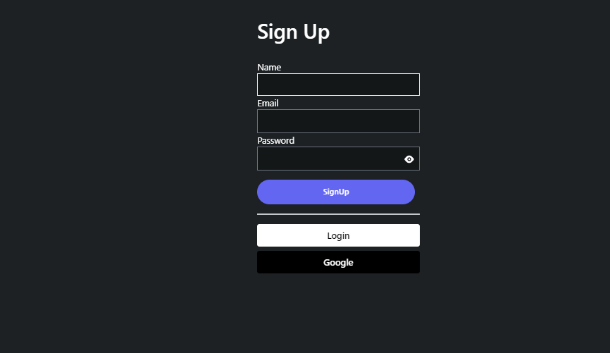
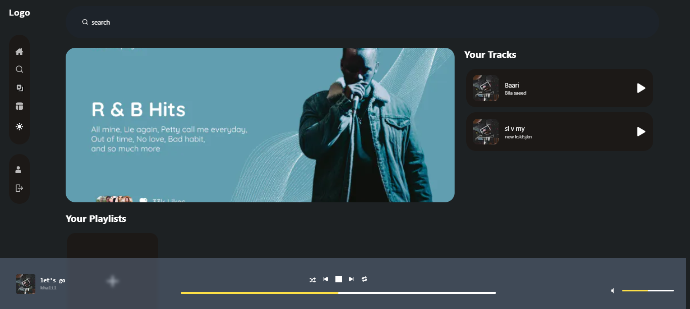
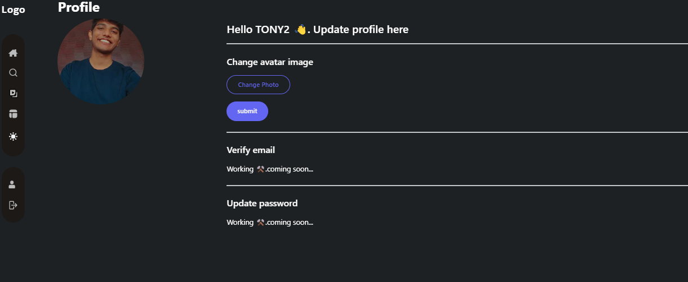
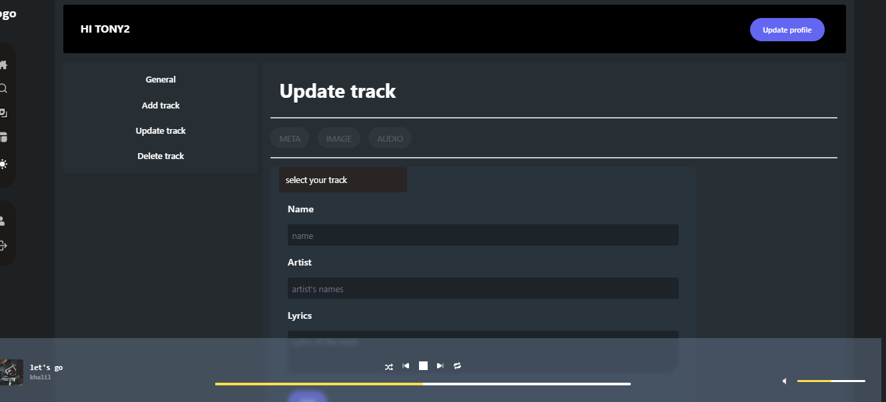
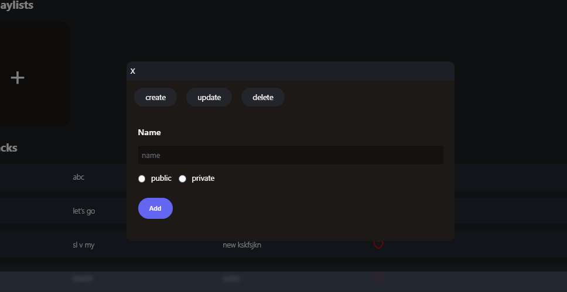
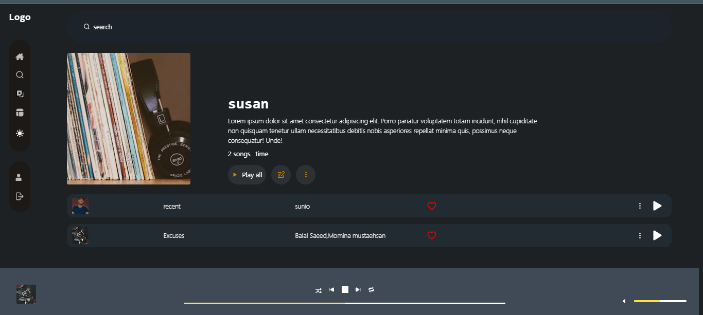
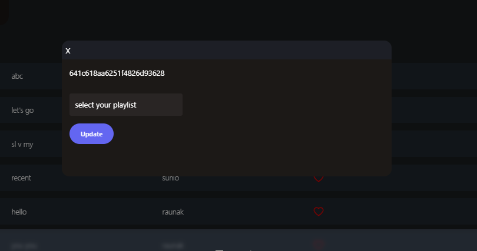
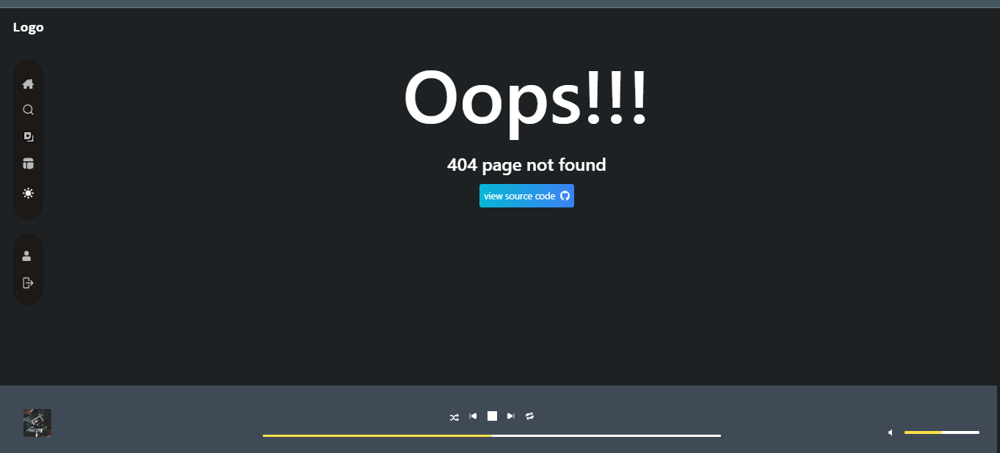

# Renm - A place where you can store and share tracks

## [Hosted Link](https://music-app.project.raunakgurud.com) 🚀

## Stack

- ⚡️ Next.js 13
- ⚛️ React 18
- ✨ TypeScript
- 💨 Tailwind CSS 3
- 📏 ESLint
- 💖 Prettier
- 🐶 Husky & Lint Staged
- 🤖 Conventional Commit Lint

## Core features

- [Authentication](#signup)
- [update Profile image](#profile)
- [upload tracks](#tracks)
- [Add to playlist](#addPlaylist)
- [create playlist](#createPlaylist)
- [playlist page](#playlistpage)
- [play your tracks](#play)
- [error page](#error)

## Getting Started

1. Clone the repository
   

   ```bash
   git clone https://github.com/raunakgurud09/music-app.git folder_name

   ```

2. cd into the directory

   ```bash
   cd folder_name
   ```

3. install dependencies
   It is encouraged to use **yarn** so the husky hooks can work properly.

   ```bash
   yarn install
   ```

4. Add .env file

   - add according to the .env.example

5. Connect to the server

   - you can use [api-music](https://github.com/raunakgurud09/api-music) as a server

6. Run the development server

7. Run your next-music-app
   ```bash
   npm run dev
   ```

Open [http://localhost:3000](http://localhost:3000) with your browser to see the result. You can start editing the page by modifying `src/pages/index.tsx`.

## Project demo

# signup



# Home



# profile



# tracks



# CreatePlaylist



# playlistpage



# addPlaylist



# error



<p>Made by <a href="https://profile.raunakgurud.com">Raunak Gurud</a></p>
